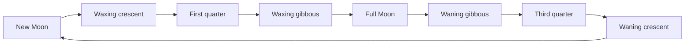

# Tutorial: from a Markdown repository to a validated EPUB

This walkthrough covers the default EPUB build, including EPUBCheck, Ace and EPUB screenshots. To export the prepared book as PDF, use the [optional PDF step](#optional-pdf-export); source fixes apply to both formats.

This tutorial takes a small book repository in the state most GitHub books are in, and turns it into an EPUB that passes EPUBCheck and the DAISY Ace accessibility check. You will run every mdbindery command on the way: `doctor`, `check`, `init`, `check --build`, `build`, and `preview`, and fix each problem the tool reports. At the end you check a real public repository by its URL.

The example book is "Backyard Astronomy", a three-chapter field guide. You can follow along with your own repository instead; the steps are the same.

Every output below comes from a real run of mdbindery 0.1.0 on Linux, and the timings are from that run. Only folder names in paths were changed: the book lives in `/home/jordan/books/backyard-astronomy` and the tools in `/home/jordan/.local/share/mdbindery`. Long outputs are shortened where marked "(trimmed)".

## Before you start

You need:

- mdbindery with its tools installed (see [installation.md](installation.md)); `mdbindery doctor` in step 2 confirms it.
- git. The book lives in a git repository: mdbindery takes the book's date from the last commit, and `mdbindery init` reads the GitHub remote to fill in `source_url`.
- curl, and Python 3 with Pillow (`pip install pillow`), for two image fixes in step 5. Any image editor works too.

The rules the book is checked against are in [book-structure.md](book-structure.md). Keep it open: each finding in this tutorial points to one of its sections.

## 1. The starting repository

The repository looks like this:

```console
$ cd ~/books/backyard-astronomy
$ find . -path ./.git -prune -o -type f -print | sort
./getting-started.md
./images/orion-sketch.png
./images/red-flashlight.bmp
./LICENSE
./planets.md
./README.md
./the-moon.md
$ git remote get-url origin
https://github.com/OWNER/backyard-astronomy.git
```

The book is on GitHub. `OWNER` stands for the account that owns the repository; in your clone it is your own account name.

`README.md` is written for GitHub visitors, with a license badge and a "Contributing" section:

```markdown
# Backyard Astronomy


A short field guide for watching the night sky from a backyard, a balcony, or a city park. Most of it needs nothing but your eyes; a pair of binoculars helps with the rest.

## Contents

- [Getting started](getting-started.md): what to bring and how to let your eyes adapt
- [The Moon](the-moon.md): phases, the terminator, and what binoculars show
- [Planets](planets.md): which planets you can see and how to tell them from stars

## Contributing

Found a mistake or have a tip from your own observing? Open an issue or a pull request. Please keep chapters short and practical, and test every instruction under a real sky.

## License

Text and images are licensed under [CC BY 4.0](LICENSE).
```

`the-moon.md` has no `#` title, a Mermaid chart, an image loaded from NASA's website, and a reference definition without a title:

````markdown
The Moon is the easiest object in the sky to find and one of the most rewarding to watch. Even a small pair of binoculars shows craters, mountain ranges, and the dark plains that early observers took for seas [1].

## Phases

The Moon takes about a month to go through its phases, because we see a different part of its sunlit half as it orbits Earth [1]. The cycle always runs in the same order:



The full Moon is the worst time to look for detail. Sunlight hits the surface head-on, shadows disappear, and the whole disk looks flat and bright.

## Watching the terminator

The terminator is the line between lunar day and lunar night. Near it, the Sun is low on the lunar horizon and even small hills cast long shadows. That is where binoculars show the most relief.


Around first quarter the terminator runs down the middle of the disk. Follow it night after night: every evening it moves a little further, and new craters come into light.

## References

[1]: https://science.nasa.gov/moon/
````

The other two chapters have their own problems. `getting-started.md` uses a BMP image, has an image with an empty alt text, and links to a section of `the-moon.md` that was renamed from "The terminator line" to "Watching the terminator":

```markdown

...

...
A bright Moon washes out faint stars. On those nights, observe the Moon itself: the section on [the terminator line](the-moon.md#the-terminator-line) explains where the detail is. For bright planets, which are not affected by moonlight, see [Planets](planets.md).
```

`planets.md` cites `[1]` and `[2]` but defines only `[1]`, and has a 10-column table:

```markdown
| Planet | Type | Naked eye | Brightness | Color | Best time | Binoculars | Small telescope | Rings visible | Notes |
|---|---|---|---|---|---|---|---|---|---|
| Mercury | Rocky | Yes | Bright | Gray-white | Low in twilight | A bright point | A tiny phase | No | Never far from the Sun |
...
[1]: https://science.nasa.gov/solar-system/planets/ "NASA Science, Planets of our Solar System"
```

There is no `mdbindery.yaml` and no cover. The chapter files have no number prefixes, so GitHub lists them alphabetically: "getting-started", "planets", "the-moon". Only the README's "Contents" list shows the intended order. On GitHub the book reads well enough; step 3 shows what would go wrong in an EPUB.

## 2. Check the tools

```console
$ mdbindery doctor
mdbindery 0.1.0
tool home: /home/jordan/.local/share/mdbindery (default; set MDBINDERY_HOME to use another)
--- tools
pandoc     pandoc 3.11
epubcheck  EPUBCheck v5.4.0
java       /usr/bin/java (version 25)
node       v24.21.0
mermaid    renders PNG
ace        1.4.6
python     3.12.14 (PyYAML 6.0.3, Pillow 12.3.0)
```

pandoc and EPUBCheck (with Java) are required; if one of them is missing, `doctor` says so and exits with 1. Node.js, mermaid-cli, and Ace are needed for charts, the accessibility check, and `preview`. If a line says "missing", run `mdbindery install-tools` and then `mdbindery doctor` again. If "mermaid" does not say "renders PNG", charts become text placeholders; see [installation.md](installation.md#headless-chrome).

The second line shows where mdbindery looks for its tools. "(default ...)" means `MDBINDERY_HOME` is not set. If you installed the tools into another folder, set `MDBINDERY_HOME` to that folder first.

## 3. Run the first check

`mdbindery check` is a dry run. It reads the repository, applies the rules, resolves every link with pandoc, test-renders the Mermaid charts, and prints a Markdown report. It writes nothing into the repository. On this book it takes about two seconds.

Output (trimmed: the suggested configuration at the end is left out, because `mdbindery init` writes the same file in step 4):

```console
$ mdbindery check .
# mdbindery check: .

**Result:** needs fixes before a correct EPUB can be built. 4 error(s), 6 warning(s), 7 note(s).

## Book

- Title: Backyard Astronomy (en-US)
- Config: none (inferred)
- Files in reading order: 4
- References: 2; footnotes: 0; charts: 1
- Images: 4 (block 2, figure 2)

## Summary

| Code | Severity | Count |
|---|---|---|
| MB200 | error | 1 |
| MB401 | error | 2 |
| MB403 | error | 1 |
| MB106 | warning | 1 |
| MB121 | warning | 1 |
| MB202 | warning | 1 |
| MB302 | warning | 1 |
| MB402 | warning | 1 |
| MB600 | warning | 1 |
| MB101 | info | 1 |
| MB120 | info | 1 |
| MB122 | info | 1 |
| MB124 | info | 1 |
| MB125 | info | 1 |
| MB306 | info | 1 |
| MB410 | info | 1 |

## Errors

- **MB401** `README.md:3` remote image: https://img.shields.io/badge/license-CC%20BY%204.0-lightgrey.svg
  - Fix: Download it into the repository (e.g. images/) and link it with a relative path; EPUB files cannot load images from the web.
- **MB403** `getting-started.md:12` image format .bmp is not supported in EPUB: images/red-flashlight.bmp
  - Fix: Convert to JPEG (photos) or PNG (diagrams, screenshots); SVG and WebP also work.
- **MB401** `the-moon.md:20` remote image: https://images-assets.nasa.gov/image/GSFC_20171208_Archive_e000866/GSFC_20171208_Archive_e000866~orig.jpg
  - Fix: Download it into the repository (e.g. images/) and link it with a relative path; EPUB files cannot load images from the web.
- **MB200** `getting-started.md:28` link to missing anchor: the-moon.md#the-terminator-line (link text: the terminator line)
  - Fix: Point the link at an existing heading (GitHub-style slug) or add <a id="..."></a> there.

## Warnings

- **MB121** no author
  - Fix: Set metadata.authors: [First Last].
- **MB402** `getting-started.md:22` image without alt text: images/orion-sketch.png
  - Fix: Describe the image: , or alt="..." on . Screen readers need it; use alt="" on  only for purely decorative images.
- **MB106** `the-moon.md:3` no level-1 heading and text above the first heading: the build makes the chapter title "The moon" from the file name (the book title for README.md)
  - Fix: Add "# Chapter title" as the first line.
- **MB302** `planets.md:5` "[2]" looks like a citation but has no definition in this file
  - Fix: Add the line  [2]: https://... "Author, Title, year"  to this file (definitions are per file), or remove the brackets.
- **MB600** `planets.md:13` table with 10 columns is hard to read on phones
  - Fix: List "planets.md" under options.cards.files to render its wide tables as cards, or split the table.
- **MB202** `README.md:19` link to LICENSE, which is not part of the book: it becomes plain text in the EPUB
  - Fix: Set source_url: https://github.com/OWNER/backyard-astronomy/blob/main/ so the link points to the online repository, or add the file to the reading order.

## Notes

- **MB101** no mdbindery.yaml: using an inferred configuration
  - Fix: Run `mdbindery init` to write one, then review the reading order and metadata.
- **MB125** reading order inferred from links in README.md
  - Fix: Check the "Reading order" list below; set files: in mdbindery.yaml to change it.
- **MB120** title inferred: "Backyard Astronomy"
  - Fix: Set metadata.title in mdbindery.yaml.
- **MB122** language inferred: en-US
  - Fix: Set metadata.lang (e.g. en-US, ru, de).
- **MB124** no identifier: a permanent urn:uuid will be generated on the first build
  - Fix: Keep "identifier:" in mdbindery.yaml so the build can save it.
- **MB410** no cover image: a plain typographic cover will be generated
  - Fix: Add cover.jpg (1600x2560 px) to the book folder or images/.
- **MB306** `the-moon.md:26` reference [1] has no title; the list will show only the URL
  - Fix: Add a title: [n]: https://example.org "Author, Title, year"

## Reading order

1. README.md
2. getting-started.md
3. the-moon.md
4. planets.md

...
$ echo $?
1
```

The exit code is 1 because the report has errors.

### Reading the report

The first line after the title is the verdict. "Ready to build" means there are no errors; "needs fixes" means at least one.

The "Book" section is what mdbindery understood: the title and language (here both guessed, since there is no config), how many files are in the reading order, and how many references, footnotes, charts, and images it found. "block 2, figure 2" counts images that stand alone on their line; the two figures also have a title in quotes, which becomes a caption. Compare these numbers with what you expect. A chapter that is missing from the count, or a chart count of zero when you have charts, tells you something is off before you read any finding.

A report with more than ten findings starts with a "Summary" table: the number of findings per code, errors first. On a large book, read it first to see which problems dominate. When one file has more than three findings with the same code, the report also groups them into one entry with the list of line numbers.

Findings come in three levels:

- Errors break the EPUB or fail the build: a missing image, a link that goes nowhere, a format readers cannot show.
- Warnings point at problems that make the book read worse or leave some readers out: an image a screen reader cannot describe, a table too wide for a phone. Fix them too. The missing heading in `the-moon.md`, for example, would put the chapter in the table of contents as "The moon", a title made from the file name.
- Notes are information: values mdbindery guessed, defaults it will use.

Each finding has a code (MB followed by three digits), the file and line when there is one, what is wrong, and a "Fix:" line. [checking.md](checking.md) lists every code.

The "Reading order" section shows the order the chapters would have in the book. Here it is right. MB125 says where it came from: the links in `README.md`, whose "Contents" list names the chapters in reading order. Without such links, mdbindery would sort the file names and put "planets.md" before "the-moon.md". When every chapter file starts with a number, mdbindery uses the numbers and ignores the README's links (step 4). It cannot tell whether an order is right, so read this list every time.

Here is where each finding gets fixed in this tutorial:

| Findings | Problem | Fixed in |
|---|---|---|
| MB101, MB120, MB121, MB122, MB125 | no config; metadata and reading order guessed or missing | step 4 |
| MB202 | README links to `LICENSE`, which is not in the book | step 4 (`init` fills in `source_url`) |
| MB600 | 10-column table | step 4 (`cards`) |
| MB410 | no cover | step 5.8 |
| MB106 | chapter without a `#` heading | step 5.1 |
| MB200 | link to a renamed heading | step 5.2 |
| MB302, MB306 | missing and untitled references | step 5.3 |
| MB402 | image without alt text | step 5.4 |
| MB401 | remote images (NASA photo, badge) | steps 5.5 and 5.6 |
| MB403 | BMP image | step 5.7 |
| MB124 | no identifier yet | step 7 (the first build) |

### Exit codes

Every mdbindery command uses the same exit codes, so scripts and CI jobs can act on them:

| Code | Meaning |
|---|---|
| 0 | success: `check` found no errors, `build` passed every gate |
| 1 | the book has problems: errors in the report, a failed build gate, or `init` refusing to overwrite a file |
| 2 | bad input: a folder or file that does not exist, a repository that cannot be fetched, a config error in `build` (`check` reports a config error as MB102, with exit code 1) |
| 3 | an internal error in mdbindery; it prints a short message and asks you to report it |

Useful options: `--report check.md` and `--json check.json` save the report to files, `-q` hides the progress lines and prints nothing when a file is given (handy in CI), and `--no-render` skips the Mermaid test render when you want a faster run.

## 4. Number the chapters and write the configuration

### Number the chapters

The inferred order is right, but only because the README's "Contents" list links the chapters in order, and GitHub still lists the chapter files alphabetically. Number prefixes put the order into the file names, where GitHub and anyone browsing the repository see it too (book-structure.md, section 1). Once every chapter file starts with a number, mdbindery takes the order from the numbers and no longer reads it from the README's links. Rename the files before you run `init`, so the config gets the new names. Use `git mv` so git records the renames:

```console
$ git mv getting-started.md 01-getting-started.md
$ git mv the-moon.md 02-the-moon.md
$ git mv planets.md 03-planets.md
$ git status --short
R  getting-started.md -> 01-getting-started.md
R  the-moon.md -> 02-the-moon.md
R  planets.md -> 03-planets.md
```

### Check again: renames break links

Output (trimmed to the verdict, the errors, the MB125 note, and the reading order):

```console
$ mdbindery check .
# mdbindery check: .

**Result:** needs fixes before a correct EPUB can be built. 8 error(s), 6 warning(s), 7 note(s).
...
## Errors

- **MB401** `README.md:3` remote image: https://img.shields.io/badge/license-CC%20BY%204.0-lightgrey.svg
  - Fix: Download it into the repository (e.g. images/) and link it with a relative path; EPUB files cannot load images from the web.
- **MB403** `01-getting-started.md:12` image format .bmp is not supported in EPUB: images/red-flashlight.bmp
  - Fix: Convert to JPEG (photos) or PNG (diagrams, screenshots); SVG and WebP also work.
- **MB401** `02-the-moon.md:20` remote image: https://images-assets.nasa.gov/image/GSFC_20171208_Archive_e000866/GSFC_20171208_Archive_e000866~orig.jpg
  - Fix: Download it into the repository (e.g. images/) and link it with a relative path; EPUB files cannot load images from the web.
- **MB204** `README.md:9` link to a missing file: getting-started.md
  - Fix: Fix the path (relative to this file) or remove the link.
- **MB204** `README.md:10` link to a missing file: the-moon.md
  - Fix: Fix the path (relative to this file) or remove the link.
- **MB204** `README.md:11` link to a missing file: planets.md
  - Fix: Fix the path (relative to this file) or remove the link.
- **MB204** `01-getting-started.md:28` link to a missing file: the-moon.md
  - Fix: Fix the path (relative to this file) or remove the link.
- **MB204** `01-getting-started.md:28` link to a missing file: planets.md
  - Fix: Fix the path (relative to this file) or remove the link.
...
- **MB125** reading order inferred from file names
  - Fix: Check the "Reading order" list below; set files: in mdbindery.yaml to change it.
...
## Reading order

1. README.md
2. 01-getting-started.md
3. 02-the-moon.md
4. 03-planets.md
...
```

MB125 now says the order comes from the file names, and it is the same order as before. The five MB204 errors are the links that still use the old file names. The same links would be broken on GitHub, so this is worth catching.

Update them in your editor, or with GNU sed (on macOS write `sed -i ''` instead of `sed -i`):

```console
$ sed -i -e 's/(getting-started\.md/(01-getting-started.md/g' \
         -e 's/(the-moon\.md/(02-the-moon.md/g' \
         -e 's/(planets\.md/(03-planets.md/g' README.md 01-getting-started.md
```

Output of the next check (trimmed to the verdict and the errors):

```console
$ mdbindery check .
# mdbindery check: .

**Result:** needs fixes before a correct EPUB can be built. 4 error(s), 6 warning(s), 7 note(s).
...
## Errors

- **MB401** `README.md:3` remote image: https://img.shields.io/badge/license-CC%20BY%204.0-lightgrey.svg
  - Fix: Download it into the repository (e.g. images/) and link it with a relative path; EPUB files cannot load images from the web.
- **MB403** `01-getting-started.md:12` image format .bmp is not supported in EPUB: images/red-flashlight.bmp
  - Fix: Convert to JPEG (photos) or PNG (diagrams, screenshots); SVG and WebP also work.
- **MB401** `02-the-moon.md:20` remote image: https://images-assets.nasa.gov/image/GSFC_20171208_Archive_e000866/GSFC_20171208_Archive_e000866~orig.jpg
  - Fix: Download it into the repository (e.g. images/) and link it with a relative path; EPUB files cannot load images from the web.
- **MB200** `01-getting-started.md:28` link to missing anchor: 02-the-moon.md#the-terminator-line (link text: the terminator line)
  - Fix: Point the link at an existing heading (GitHub-style slug) or add <a id="..."></a> there.
...
```

The MB200 error from the first check is back. While the link pointed to a file that did not exist, mdbindery could not check the anchor inside it.

### Write mdbindery.yaml

`mdbindery init` writes a starter `mdbindery.yaml` from what `check` inferred:

```console
$ mdbindery init
wrote /home/jordan/books/backyard-astronomy/mdbindery.yaml (reading order from file names)
review the title, authors, and file order, then run: mdbindery check .
```

```yaml
# mdbindery configuration: https://github.com/sagol/mdbindery/blob/main/docs/configuration.md
slug: "backyard-astronomy"         # names the EPUB file
output_dir: "dist"
# online copy of the book folder: links to files outside the book point here
source_url: "https://github.com/OWNER/backyard-astronomy/blob/main/"

metadata:
  title: "Backyard Astronomy"
  subtitle: ""
  authors: []          # ["First Last"]
  lang: "en-US"
  # identifier: left empty, a permanent urn:uuid is written here on the first build
  identifier:
  date: "git"
  rights: "CC BY 4.0"
  description: ""

cover:
  image: ""          # 1600x2560 JPEG recommended; empty = generated

# reading order (found from file names)
files:
  - file: "README.md"
    role: "front"
  - "01-getting-started.md"
  - "02-the-moon.md"
  - "03-planets.md"

options:
  citations: refdefs
  toc_depth: 2
```

It found the title in the README heading, the license in `LICENSE`, and the reading order in the file names; the comment above `files:` says so. From now on the order is the `files:` list, and you change it there. `source_url` comes from the git remote: the repository is on GitHub, on branch `main`, so links to files outside the book (such as `LICENSE`) will point to the files on GitHub. In a folder without a GitHub remote, `init` leaves `source_url` empty; set it yourself if the book links to files outside it. `identifier:` stays empty on purpose, as the comment above it says.

Running `init` again leaves the file alone:

```console
$ mdbindery init
/home/jordan/books/backyard-astronomy/mdbindery.yaml already exists (use --force to rewrite it; a backup is kept)
$ echo $?
1
```

With `--force`, `init` writes a fresh file with its comments but keeps the values you set: the metadata (including the identifier), the `files` list, the cover settings, and the options. The old file is saved as `mdbindery.yaml.bak`.

### Edit mdbindery.yaml

Now fill in what `init` could not know. The edited file:

```yaml
# mdbindery configuration: https://github.com/sagol/mdbindery/blob/main/docs/configuration.md
slug: "backyard-astronomy"         # names the EPUB file
output_dir: "dist"
# online copy of the book folder: links to files outside the book point here
source_url: "https://github.com/OWNER/backyard-astronomy/blob/main/"

metadata:
  title: "Backyard Astronomy"
  subtitle: "A field guide for clear nights"
  authors: ["Jordan Lee"]
  lang: "en-US"
  # identifier: left empty, a permanent urn:uuid is written here on the first build
  identifier:
  date: "git"
  rights: "Text and images licensed under CC BY 4.0"
  description: "A short, practical guide to the night sky for observers with their eyes and a pair of binoculars."

cover:
  image: "images/cover.jpg"          # 1600x2560 JPEG recommended; empty = generated

# reading order (found from file names)
files:
  - file: "README.md"
    role: "front"
    title: "About this book"
    drop_sections: ["Contributing"]
  - "01-getting-started.md"
  - "02-the-moon.md"
  - "03-planets.md"

options:
  citations: refdefs
  toc_depth: 2
  cards:
    files: ["03-planets.md"]
```

What changed and why:

| Key | Change | Reason |
|---|---|---|
| `source_url` | none | `init` took it from the git remote; the README's link to `LICENSE` now points to the file on GitHub (MB202) |
| `metadata.subtitle` | added | shown on the title page |
| `metadata.authors` | `["Jordan Lee"]` | MB121 |
| `metadata.lang` | kept, now set on purpose | MB122; it drives hyphenation and the reader's dictionary |
| `metadata.identifier` | left empty, as `init` wrote it | the first build writes a permanent `urn:uuid` into this line (MB124) |
| `metadata.rights` | a full sentence instead of "CC BY 4.0" | this text appears on the title page |
| `metadata.description` | added | stored in the EPUB; reading apps can show it |
| `cover.image` | `images/cover.jpg` | the cover you add in step 5.8 |
| `title` for `README.md` | `About this book` | the book's first section should not be titled "Backyard Astronomy" twice |
| `drop_sections` for `README.md` | `["Contributing"]` | that section is for GitHub visitors only; it stays in the README and is left out of the EPUB |
| `options.cards.files` | `["03-planets.md"]` | renders the 10-column table as one card per planet (MB600) |

`date: "git"` means the book's date is the date of the last commit. Every key is described in [configuration.md](configuration.md).

### Check the configuration

Output (trimmed to the verdict and the errors):

```console
$ mdbindery check .
# mdbindery check: .

**Result:** needs fixes before a correct EPUB can be built. 5 error(s), 3 warning(s), 2 note(s).
...
## Errors

- **MB412** cover image not found: images/cover.jpg
  - Fix: Fix cover.image in mdbindery.yaml.
- **MB401** `README.md:3` remote image: https://img.shields.io/badge/license-CC%20BY%204.0-lightgrey.svg
  - Fix: Download it into the repository (e.g. images/) and link it with a relative path; EPUB files cannot load images from the web.
- **MB403** `01-getting-started.md:12` image format .bmp is not supported in EPUB: images/red-flashlight.bmp
  - Fix: Convert to JPEG (photos) or PNG (diagrams, screenshots); SVG and WebP also work.
- **MB401** `02-the-moon.md:20` remote image: https://images-assets.nasa.gov/image/GSFC_20171208_Archive_e000866/GSFC_20171208_Archive_e000866~orig.jpg
  - Fix: Download it into the repository (e.g. images/) and link it with a relative path; EPUB files cannot load images from the web.
- **MB200** `01-getting-started.md:28` link to missing anchor: 02-the-moon.md#the-terminator-line (link text: the terminator line)
  - Fix: Point the link at an existing heading (GitHub-style slug) or add <a id="..."></a> there.
...
```

The findings the config took care of (metadata, the `LICENSE` link, the wide table) are gone. MB125 is gone too, because the order now comes from `files:` and is no longer inferred. MB412 is new: the config now names a cover that does not exist yet.

## 5. Fix the findings

Each fix below shows the Markdown before and after. Run `mdbindery check .` as often as you like; it is fast.

### 5.1 Missing chapter heading (MB106)

Every chapter file starts with exactly one level-1 heading. It becomes the chapter title in the table of contents and starts a new file inside the EPUB (book-structure.md, section 3).

`02-the-moon.md` has none, so the build has to make one up. The file starts with text, so MB106 says the build takes the title from the file name: "The moon", with a lowercase "m", and the build log line for the file ends with "title made from the file name". (A file that starts with a `##` heading gets that heading promoted to the chapter title instead.) Write the title yourself.

Before, `02-the-moon.md` starts with text:

```markdown
The Moon is the easiest object in the sky to find and one of the most rewarding to watch. ...

## Phases
```

After:

```markdown
# The Moon

The Moon is the easiest object in the sky to find and one of the most rewarding to watch. ...

## Phases
```

### 5.2 Link to a renamed heading (MB200)

Anchors follow GitHub's rule: the heading text in lowercase, spaces replaced by hyphens, punctuation removed. `## Watching the terminator` becomes `#watching-the-terminator`. The link still uses the slug of the old heading.

Before, in `01-getting-started.md`:

```markdown
A bright Moon washes out faint stars. On those nights, observe the Moon itself: the section on [the terminator line](02-the-moon.md#the-terminator-line) explains where the detail is. For bright planets, which are not affected by moonlight, see [Planets](03-planets.md).
```

After:

```markdown
A bright Moon washes out faint stars. On those nights, observe the Moon itself: the section on [watching the terminator](02-the-moon.md#watching-the-terminator) explains where the detail is. For bright planets, which are not affected by moonlight, see [Planets](03-planets.md).
```

If other people link to the old anchor (from their own sites, say), keep it alive instead: put `<a id="the-terminator-line"></a>` on its own line, followed by a blank line, just above `## Watching the terminator`. Links to `#the-terminator-line` then work on GitHub and in the EPUB.

### 5.3 Citations (MB302, MB306)

Reference definitions are per file: every chapter defines the numbers it cites (book-structure.md, section 5). `03-planets.md` cites `[2]` but only defines `[1]`.

Before, at the end of `03-planets.md`:

```markdown
## References

[1]: https://science.nasa.gov/solar-system/planets/ "NASA Science, Planets of our Solar System"
```

After:

```markdown
## References

[1]: https://science.nasa.gov/solar-system/planets/ "NASA Science, Planets of our Solar System"
[2]: https://www.iau.org/ "International Astronomical Union, official website"
```

The text in quotes is what readers see in the reference list. `02-the-moon.md` has a definition without one (MB306), so its list would show a bare URL.

Before:

```markdown
[1]: https://science.nasa.gov/moon/
```

After:

```markdown
[1]: https://science.nasa.gov/moon/ "NASA Science, Earth's Moon"
```

On GitHub these definitions stay invisible. In the EPUB, mdbindery builds a numbered list under the "References" heading and links each `[1]` in the text to its entry.

### 5.4 Image without alt text (MB402)

Alt text is what a screen reader says instead of the image. Markdown has no way to mark an image as decorative, so an empty alt text (``) counts as missing. (For a purely decorative image, use an HTML `` with `alt=""`.) While any image lacks alt text, the EPUB also stops claiming in its accessibility metadata that images have text alternatives. Describe what the image shows in one short sentence. The caption (the quoted title after the path) is shown below the image; it adds to the alt text and does not replace it.

Before, in `01-getting-started.md`:

```markdown

```

After:

```markdown

```

Keep alt text short. A long description belongs in the text, where every reader gets it.

The check after these four fixes (trimmed to remove the reading order) shows only image and cover problems left:

```console
$ mdbindery check .
# mdbindery check: .

**Result:** needs fixes before a correct EPUB can be built. 4 error(s), 0 warning(s), 1 note(s).

## Book

- Title: Backyard Astronomy (en-US)
- Config: /home/jordan/books/backyard-astronomy/mdbindery.yaml
- Files in reading order: 4
- References: 3; footnotes: 0; charts: 1
- Images: 4 (block 2, figure 2)

## Errors

- **MB412** cover image not found: images/cover.jpg
  - Fix: Fix cover.image in mdbindery.yaml.
- **MB401** `README.md:3` remote image: https://img.shields.io/badge/license-CC%20BY%204.0-lightgrey.svg
  - Fix: Download it into the repository (e.g. images/) and link it with a relative path; EPUB files cannot load images from the web.
- **MB403** `01-getting-started.md:12` image format .bmp is not supported in EPUB: images/red-flashlight.bmp
  - Fix: Convert to JPEG (photos) or PNG (diagrams, screenshots); SVG and WebP also work.
- **MB401** `02-the-moon.md:22` remote image: https://images-assets.nasa.gov/image/GSFC_20171208_Archive_e000866/GSFC_20171208_Archive_e000866~orig.jpg
  - Fix: Download it into the repository (e.g. images/) and link it with a relative path; EPUB files cannot load images from the web.

## Notes

- **MB124** no identifier: a permanent urn:uuid will be generated on the first build
  - Fix: Keep "identifier:" in mdbindery.yaml so the build can save it.
...
```

The Moon image moved from line 20 to line 22 because of the new heading. MB124 stays until the first build writes the identifier.

### 5.5 Remote image (MB401)

An EPUB cannot load images from the web. The build would put the text "[image: First quarter Moon]" where the photo should be and fail its images gate. Download the image into `images/` and link it with a relative path. Before you do, make sure you may redistribute it; this one is from NASA's image library, and the caption credits the source.

```console
$ curl -sSL -o images/first-quarter-moon.jpg "https://images-assets.nasa.gov/image/GSFC_20171208_Archive_e000866/GSFC_20171208_Archive_e000866~orig.jpg"
```

Before, in `02-the-moon.md`:

```markdown

```

After:

```markdown

```

### 5.6 README badge (MB401)

The license badge is also a remote image. You could download it the same way, but a badge means nothing in a book, and the README's "License" section already says the same thing. Delete the line and the blank line after it.

Before, at the top of `README.md`:

```markdown
# Backyard Astronomy


A short field guide for watching the night sky from a backyard, a balcony, or a city park. ...
```

After:

```markdown
# Backyard Astronomy

A short field guide for watching the night sky from a backyard, a balcony, or a city park. ...
```

### 5.7 BMP image (MB403)

EPUB readers show JPEG, PNG, SVG, GIF, and WebP. BMP, TIFF, HEIC, PSD, AVIF, and PDF do not work (book-structure.md, section 6). The flashlight is a drawing, so convert it to PNG. With Python and Pillow:

```console
$ python3 -c "from PIL import Image; Image.open('images/red-flashlight.bmp').save('images/red-flashlight.png')"
$ git rm -q images/red-flashlight.bmp
```

With ImageMagick, the first command is `magick images/red-flashlight.bmp images/red-flashlight.png`. The PNG is also much smaller: 4 KB instead of 940 KB.

Before, in `01-getting-started.md`:

```markdown

```

After:

```markdown

```

### 5.8 Cover (MB412)

The config names `images/cover.jpg`, so the check reports it missing (MB412) until you add it. Export your cover design as a JPEG (or PNG) of 1600x2560 pixels in RGB. That is the size book-structure.md recommends: a height-to-width ratio of 1.6 and more than the 1400 pixels on the short side that stores ask for. Save it as `images/cover.jpg` and confirm the size:

```console
$ python3 -c "from PIL import Image; im = Image.open('images/cover.jpg'); print(im.format, im.size, im.mode)"
JPEG (1600, 2560) RGB
```

Any image viewer that shows pixel dimensions works as well. If a book has no cover at all, leave `cover.image` empty: mdbindery generates a plain typographic cover from the title, subtitle, and author (MB410).

### Check until clean

```console
$ mdbindery check .
# mdbindery check: .

**Result:** ready to build. 0 error(s), 0 warning(s), 1 note(s).

## Book

- Title: Backyard Astronomy (en-US)
- Config: /home/jordan/books/backyard-astronomy/mdbindery.yaml
- Files in reading order: 4
- References: 3; footnotes: 0; charts: 1
- Images: 3 (block 1, figure 2)

## Notes

- **MB124** no identifier: a permanent urn:uuid will be generated on the first build
  - Fix: Keep "identifier:" in mdbindery.yaml so the build can save it.

## Reading order

1. README.md
2. 01-getting-started.md
3. 02-the-moon.md
4. 03-planets.md
$ echo $?
0
```

No errors, no warnings, and the reading order is right. The image count dropped from 4 to 3 because the badge is gone. Commit the work:

```sh
git add -A
git commit -m "Fix everything mdbindery check reported"
```

## 6. Trial build

`check` looks at the sources. A trial build goes further: it builds the whole EPUB in a temporary folder, runs EPUBCheck, Ace, and the word-count check on it, and reports what they find. On this book it takes 15 to 20 seconds.

```console
$ mdbindery check . --build
# mdbindery check: .

**Result:** ready to build. 0 error(s), 0 warning(s), 1 note(s).

## Book

- Title: Backyard Astronomy (en-US)
- Config: /home/jordan/books/backyard-astronomy/mdbindery.yaml
- Files in reading order: 4
- References: 3; footnotes: 0; charts: 1
- Images: 3 (block 1, figure 2)
- Trial build: passed (235 KB)

## Notes

- **MB124** no identifier: a permanent urn:uuid will be generated on the first build
  - Fix: Keep "identifier:" in mdbindery.yaml so the build can save it.

## Reading order

1. README.md
2. 01-getting-started.md
3. 02-the-moon.md
4. 03-planets.md
```

"Trial build: passed (235 KB)" means every gate passed and the EPUB would be about 235 KB. When a gate fails, the line says "failed:" followed by the names of the failed gates, and each problem becomes an error in the report: MB900 for EPUBCheck messages, MB901 for Ace violations, MB902 for text lost or added in conversion, MB904 for any other failed gate, and MB903 when the build could not run at all. So a report after a failed trial build never says "ready to build". The trial build is skipped while the static check still has errors.

A trial build changes nothing in the repository. It deletes the EPUB afterwards and uses a temporary identifier, so MB124 is still listed and `git status` shows no changes. The permanent identifier comes with the first real build.

## 7. Build

On this book the build takes about 15 seconds:

```console
$ mdbindery build
mdbindery: backyard-astronomy (4 files) from /home/jordan/books/backyard-astronomy
  generated identifier urn:uuid:afa47703-93ca-4a91-93fa-44c2fa8e5444 (saved in mdbindery.yaml)
  k00 README.md: dropped ['Contributing']
  k01 01-getting-started.md: 2 image(s)
  k02 02-the-moon.md: 1 refs, 1 chart(s), 2 image(s)
  k03 03-planets.md: 2 refs, tables as cards
  built /home/jordan/books/backyard-astronomy/dist/backyard-astronomy.epub (235 KB)
  EPUBCheck: no messages
  Ace: 0 violation(s), 0 blocking
  word count: every file within 2% or 25 words of its source
BUILD OK
```

Line by line:

- The first line gives the slug (the output file name), the number of files, and the source folder.
- `generated identifier`: this is the book's first build, so it created a permanent identifier and wrote it into `mdbindery.yaml` (see below). Later builds reuse it and do not print this line.
- Each file gets a key in reading order (`k00`, `k01`, ...) and a summary. The README lost its "Contributing" section. `02-the-moon.md` has one reference list entry, one chart, and two images: the Moon photo and the chart, which is now a PNG. `03-planets.md` has two references and its table is rendered as cards. This is also where the build reports what it fixed on its own, such as "title made from the file name" for a chapter without a `#` heading.
- `EPUBCheck: no messages`: EPUBCheck, the reference validator for EPUB, found no errors and no warnings.
- `Ace: 0 violation(s), 0 blocking`: the DAISY accessibility check found nothing. Critical and serious violations fail the build; others are listed and do not.
- `word count: every file within 2% or 25 words of its source`: the word-count check compares the words in each Markdown file with the words in its part of the EPUB, to catch text lost in conversion (usually broken HTML). A file fails the check when it differs by more than 2% and by more than 25 words. When a file differs by more than 25 words without failing, the line adds "largest difference N% in FILE". When a file fails, the line starts with "word count: FAILED" and names the files with both word counts. Files rendered as cards are checked too. Each card repeats the column names, so `03-planets.md` has 321 words in Markdown and 398 in the EPUB; the check subtracts the repeated names before comparing and records the adjusted count under `compared` in `build.json`. It counts words, so it cannot notice a word swapped for another.
- `BUILD OK`: every gate passed, and the exit code is 0. When a gate fails, the exit code is 1 and the last line names the failed gates and where the details are, for example `BUILD FAILED: images (details: .../dist/reports/build.json)`. The exit code is 2 when the build could not run at all, for example because of an invalid config.

The first build wrote the identifier into the config, into the empty line that `init` left for it:

```console
$ git diff
diff --git a/mdbindery.yaml b/mdbindery.yaml
index 452c5dd..a87e097 100644
--- a/mdbindery.yaml
+++ b/mdbindery.yaml
@@ -10,7 +10,7 @@ metadata:
   authors: ["Jordan Lee"]
   lang: "en-US"
   # identifier: left empty, a permanent urn:uuid is written here on the first build
-  identifier:
+  identifier: urn:uuid:afa47703-93ca-4a91-93fa-44c2fa8e5444
   date: "git"
   rights: "Text and images licensed under CC BY 4.0"
   description: "A short, practical guide to the night sky for observers with their eyes and a pair of binoculars."
```

Commit it, and keep it for every future version of the book. Add a `.gitignore` for the build output and the screenshots you will take in step 8:

```sh
printf 'dist/\nshots*/\n' > .gitignore
git add -A
git commit -m "Save the book identifier; ignore dist/"
```

### What the build wrote

```console
$ find dist -maxdepth 2
dist
dist/backyard-astronomy.epub
dist/backyard-astronomy-cover.jpg
dist/reports
dist/reports/build.log
dist/reports/build.json
dist/reports/ace
dist/reports/epubcheck.json
```

| File | What it is |
|---|---|
| `backyard-astronomy.epub` | the book |
| `backyard-astronomy-cover.jpg` | the cover at full size (1600x2560), for stores that want it as a separate upload; the copy inside the EPUB is scaled to 1000 px tall |
| `reports/build.log` | the build output shown above |
| `reports/build.json` | the machine-readable summary: the result of each gate, per-file statistics, links, word counts, and `failed_gates` |
| `reports/epubcheck.json` | EPUBCheck's full report |
| `reports/ace/report.html` | Ace's accessibility report; open it in a browser (`report.json` has the same data) |

Each build replaces these report files and leaves anything else in `reports/` alone. When a gate fails, start with `reports/build.json`. For the word-count gate, `gates.wordcount.files` lists the source and EPUB word counts for every file and `gates.wordcount.failing` names the files that failed. `mdbindery build --keep-work` keeps the intermediate files and prints where they are.

Other build options: `-o FOLDER` writes somewhere other than `dist/`, `--no-ace` skips the accessibility check, and `-q` prints only the last line. The gates are described in [building.md](building.md#gates).

### Same commit, same file

Building the same commit twice with the same tools gives the same bytes, because file dates inside the EPUB come from the last commit, not from the clock. A checksum tells you whether a new build differs from the file you uploaded:

```console
$ mdbindery build -q
BUILD OK
$ sha256sum dist/backyard-astronomy.epub
7466bc6dbe4081b14962108580de95d2ec2b3d01fdcf63fc72448f3ee1184969  dist/backyard-astronomy.epub
$ mdbindery build -q
BUILD OK
$ sha256sum dist/backyard-astronomy.epub
7466bc6dbe4081b14962108580de95d2ec2b3d01fdcf63fc72448f3ee1184969  dist/backyard-astronomy.epub
```

## 8. Preview

The gates prove the EPUB is valid. They cannot tell you whether it looks right on a phone. `mdbindery preview` opens pages of the EPUB in the headless Chrome that mdbindery installed for charts, at phone size (412x915 CSS pixels, saved at double resolution), and saves screenshots. It needs Node.js and Puppeteer, which `mdbindery install-tools` installs unless you used `--no-node`.

Without a list of pages, it takes the cover, the title page, the table of contents, and the first two content files. It prints the name of each file it writes:

```console
$ mdbindery preview dist/backyard-astronomy.epub shots
shots/nav.png
shots/text_title_page.png
shots/text_cover.png
shots/text_ch001.png
shots/text_ch002.png
```

Name pages to capture others. `--full` captures the whole page instead of one screen and adds `_full` to the file name:

```console
$ mdbindery preview dist/backyard-astronomy.epub shots text/ch003.xhtml text/ch004.xhtml --full
shots/text_ch003_full.png
shots/text_ch004_full.png
```

To start a screenshot at a section, add its id. Ids inside the EPUB are the file key from the build log plus the GitHub anchor: `watching-the-terminator` in `02-the-moon.md` (key `k02`) becomes `k02-watching-the-terminator`. The README keeps the anchor of its original heading, `k00-backyard-astronomy`, under its new title. The table of contents lists them all:

```console
$ unzip -p dist/backyard-astronomy.epub EPUB/nav.xhtml | grep -o 'href="text/[^"]*"'
href="text/ch001.xhtml#k00-backyard-astronomy"
href="text/ch001.xhtml#k00-contents"
href="text/ch001.xhtml#k00-license"
href="text/ch002.xhtml#k01-getting-started"
href="text/ch002.xhtml#k01-what-to-bring"
href="text/ch002.xhtml#k01-dark-adaptation"
href="text/ch002.xhtml#k01-your-first-constellation"
href="text/ch002.xhtml#k01-when-the-moon-is-up"
href="text/ch003.xhtml#k02-the-moon"
href="text/ch003.xhtml#k02-phases"
href="text/ch003.xhtml#k02-watching-the-terminator"
href="text/ch003.xhtml#k02-references"
href="text/ch004.xhtml#k03-planets"
href="text/ch004.xhtml#k03-telling-a-planet-from-a-star"
href="text/ch004.xhtml#k03-what-each-planet-shows"
href="text/ch004.xhtml#k03-references"
href="text/title_page.xhtml"
href="text/cover.xhtml"
$ mdbindery preview dist/backyard-astronomy.epub shots 'text/ch003.xhtml#k02-watching-the-terminator'
shots/text_ch003_k02-watching-the-terminator.png
```

Each chapter is one file: `ch001.xhtml` is the README, `ch002.xhtml` the first chapter, and so on. A page name that is not in the EPUB stops `preview` with exit code 2 and a list of the pages there are:

```console
$ mdbindery preview dist/backyard-astronomy.epub shots text/ch005.xhtml
preview error: not in the EPUB: text/ch005.xhtml
pages: nav.xhtml, text/ch001.xhtml, text/ch002.xhtml, text/ch003.xhtml, text/ch004.xhtml, text/cover.xhtml, text/title_page.xhtml
```

An id that does not exist only gives a warning, and the screenshot shows the top of the page. Use `--width` and `--height` for other screen sizes.

### What to look at

Open the PNG files in any image viewer. This is what the screenshots of this book showed, and what to check in yours:

- `text_cover.png`: the cover fills the width of the screen. Check that the title is readable at this size.
- `text_title_page.png`: title, subtitle, author, date, and rights. The date (2026-09-22) is the date of the last commit. Check spelling and the rights text.
- `nav.png`: the table of contents. "About this book" comes first with "Contents" and "License" under it, then the three chapters with their sections. Every chapter should be there under its own title; a title that looks like a file name means a missing `#` heading.
- `text_ch001.png`: the README as "About this book", without the badge and without "Contributing". Its "Contents" list of chapter links is still there, and it repeats the table of contents.
- `text_ch002.png`: "Getting started" with the flashlight PNG as a full-width block image. Check that images have a sensible size and that nothing from GitHub-only markup is left.
- `text_ch003_full.png`: the Moon chapter. The phase chart is there, but its eight boxes sit in one row across a phone-width screen, and the labels are too small to read. Below it, the Moon photo with its caption in italics, and the "References" list with "[1] NASA Science, Earth's Moon." and the link.
- `text_ch003_k02-watching-the-terminator.png`: the same page, scrolled down to the terminator section.
- `text_ch004_full.png`: the planet table as seven cards, each headed by the planet's name, with every value labeled by its column. At the bottom, the reference list with entries [1] and [2]. Check that the `[1]` and `[2]` markers in the text are underlined as links.

This book has no footnotes. In a book that has them (`[^1]` in the text), each chapter's notes appear at the end of the chapter as numbered endnotes, and each number links back to its place in the text. Check a few of them in the preview too.

Two things need fixing: the unreadable chart and the duplicate contents list.

### Fixing what the preview shows

A left-to-right chart with eight boxes is fine on a desktop and too wide for a phone. Split it into two rows. `mermaid_alt` in the config gives the chart a proper text alternative. By default the alt text is built from the node labels, and for this chart it would drop the waxing and waning groups and list "Crescent" and "Gibbous" only once. The README's "Contents" section joins "Contributing" in `drop_sections`.

````console
$ git diff
diff --git a/02-the-moon.md b/02-the-moon.md
index b76e1c9..505f2cd 100644
--- a/02-the-moon.md
+++ b/02-the-moon.md
@@ -7,10 +7,16 @@ The Moon is the easiest object in the sky to find and one of the most rewarding
 The Moon takes about a month to go through its phases, because we see a different part of its sunlit half as it orbits Earth [1]. The cycle always runs in the same order:
 
 ```mermaid
-flowchart LR
-    A[New Moon] --> B[Waxing crescent] --> C[First quarter] --> D[Waxing gibbous]
-    D --> E[Full Moon] --> F[Waning gibbous] --> G[Third quarter] --> H[Waning crescent]
-    H --> A
+flowchart TB
+    subgraph waxing [Waxing: the lit part grows]
+        direction LR
+        A[New Moon] --> B[Crescent] --> C[First quarter] --> D[Gibbous]
+    end
+    subgraph waning [Waning: the lit part shrinks]
+        direction LR
+        E[Full Moon] --> F[Gibbous] --> G[Third quarter] --> H[Crescent]
+    end
+    waxing --> waning
 ```
 
 The full Moon is the worst time to look for detail. Sunlight hits the surface head-on, shadows disappear, and the whole disk looks flat and bright.
diff --git a/mdbindery.yaml b/mdbindery.yaml
index a87e097..44f0e2c 100644
--- a/mdbindery.yaml
+++ b/mdbindery.yaml
@@ -23,9 +23,10 @@ files:
   - file: "README.md"
     role: "front"
     title: "About this book"
-    drop_sections: ["Contributing"]
+    drop_sections: ["Contents", "Contributing"]
   - "01-getting-started.md"
-  - "02-the-moon.md"
+  - file: "02-the-moon.md"
+    mermaid_alt: "Chart of the Moon's phases in order. Waxing: New Moon, crescent, first quarter, gibbous. Waning: full Moon, gibbous, third quarter, crescent."
   - "03-planets.md"
 
 options:
````

GitHub renders the new chart too, so the repository stays readable. Check again:

```console
$ mdbindery check .
# mdbindery check: .

**Result:** ready to build. 0 error(s), 0 warning(s), 0 note(s).

## Book

- Title: Backyard Astronomy (en-US)
- Config: /home/jordan/books/backyard-astronomy/mdbindery.yaml
- Files in reading order: 4
- References: 3; footnotes: 0; charts: 1
- Images: 3 (block 1, figure 2)

## Reading order

1. README.md
2. 01-getting-started.md
3. 02-the-moon.md
4. 03-planets.md
```

The last note (MB124) is gone, because the config now has an identifier. Commit, build, and take new screenshots:

```sh
git commit -am "Phone-friendly chart; drop the README contents list from the EPUB"
```

```console
$ mdbindery build
mdbindery: backyard-astronomy (4 files) from /home/jordan/books/backyard-astronomy
  k00 README.md: dropped ['Contents', 'Contributing']
  k01 01-getting-started.md: 2 image(s)
  k02 02-the-moon.md: 1 refs, 1 chart(s), 2 image(s)
  k03 03-planets.md: 2 refs, tables as cards
  built /home/jordan/books/backyard-astronomy/dist/backyard-astronomy.epub (263 KB)
  EPUBCheck: no messages
  Ace: 0 violation(s), 0 blocking
  word count: every file within 2% or 25 words of its source
BUILD OK
$ mdbindery preview dist/backyard-astronomy.epub shots2 text/ch001.xhtml text/ch003.xhtml
shots2/text_ch001.png
shots2/text_ch003.png
```

In the new screenshots, "About this book" has only its introduction and the "License" section, and the chart shows two labeled rows of four boxes ("Waxing: the lit part grows" and "Waning: the lit part shrinks") whose labels are readable at phone width. The EPUB grew by 28 KB because the chart image is larger.

Screenshots are a quick check. Before you publish, also read the book once in a real reading app, such as Apple Books, Thorium Reader, or the Calibre e-book viewer.

## 9. Checking a GitHub repository by URL

`check` also accepts a repository URL, so you can see how far a book on GitHub is from an EPUB before you clone it:

```sh
mdbindery check https://github.com/OWNER/REPO
mdbindery check https://github.com/OWNER/REPO --ref BRANCH
mdbindery check https://github.com/OWNER/REPO/tree/BRANCH
mdbindery check https://github.com/OWNER/REPO/tree/BRANCH/FOLDER
```

The first form checks the default branch. `--ref` and the `/tree/BRANCH` form (as copied from the browser's address bar) check a branch or tag; add a folder after the branch when the book is not at the top of the repository. `github.com/OWNER/REPO` without `https://` and `git@github.com:OWNER/REPO.git` work too. mdbindery makes a shallow clone into a temporary folder (or downloads the branch as a ZIP file when git is not installed), checks it, and deletes it. Nothing is written anywhere else. Other git hosts work with a git URL, such as one that ends in `.git`; those need git. All the options from step 3 apply, including `--build`. [checking.md](checking.md) lists every accepted form.

Here is a real public repository, a nonfiction book with fifteen chapters and an appendix, on its `visionary-book-edit` branch. The first line goes to stderr; the rest is the report. Output (trimmed):

```console
$ mdbindery check https://github.com/sagol/Fully-Autonomous-Initial-Mars-Colony --ref visionary-book-edit
fetching https://github.com/sagol/Fully-Autonomous-Initial-Mars-Colony.git (visionary-book-edit)
# mdbindery check: https://github.com/sagol/Fully-Autonomous-Initial-Mars-Colony (branch visionary-book-edit)

**Result:** ready to build. 0 error(s), 2 warning(s), 8 note(s).

## Book

- Title: Fully Autonomous Initial Mars Colony (en-US)
- Config: none (inferred)
- Files in reading order: 17
- References: 535; footnotes: 0; charts: 1
- Images: 0

## Warnings

- **MB121** no author
  - Fix: Set metadata.authors: [First Last].
- **MB600** `Appendix A. Risk register.md:118` table with 12 columns is hard to read on phones
  - Fix: List "Appendix A. Risk register.md" under options.cards.files to render its wide tables as cards, or split the table.

## Notes

- **MB101** no mdbindery.yaml: using an inferred configuration
  - Fix: Run `mdbindery init` to write one, then review the reading order and metadata.
- **MB125** reading order inferred from file names
  - Fix: Check the "Reading order" list below; set files: in mdbindery.yaml to change it.
...
- **MB410** no cover image: a plain typographic cover will be generated
  - Fix: Add cover.jpg (1600x2560 px) to the book folder or images/.
- **MB720** `04. Transportation and landing.md:89` code block has lines over 90 characters; they wrap on small screens
  - Fix: Shorten long lines if the layout matters.
- **MB202** `README.md:96` link to LICENSE (not in the book) will point to the online repository
  - Fix: Set source_url: https://github.com/sagol/Fully-Autonomous-Initial-Mars-Colony/blob/visionary-book-edit/

## Reading order

1. README.md
2. 01. Mission concept and autonomy.md
3. 02. Baseline and budgets.md
...
16. 15. Terraforming and the long view.md
17. Appendix A. Risk register.md

## Suggested mdbindery.yaml
...
```

This repository is in much better shape than our example was. The check took about 12 seconds, found 535 reference definitions across 17 files, and no errors. Every chapter file has a number prefix, so MB125 says the order comes from the file names: chapters 1 to 15 in numeric order, and the file with "Appendix" in its name last. The README also links to chapters, some of them out of order in its introduction, but with numbered files those links do not change the order.

The rest is configuration: an author, cards for the 12-column risk register, and a cover. MB202 is only a note here. For a repository URL, mdbindery computes `source_url` from the URL and the branch, so the link to `LICENSE` will point to GitHub, and the suggested `mdbindery.yaml` at the end of the report already contains that value. After cloning, `mdbindery init` writes the same value from the git remote.

With `--build`, the same command also ran a trial build of the cloned book in about 50 seconds, and the "Book" section gained one line:

```text
- Trial build: passed (473 KB)
```

When the repository, branch, or folder cannot be found, `check` stops with exit code 2 and one message:

```console
$ mdbindery check https://github.com/sagol/Fully-Autonomous-Initial-Mars-Colony/tree/visionary-book-edit/book
fetching https://github.com/sagol/Fully-Autonomous-Initial-Mars-Colony.git (visionary-book-edit)
check error: subfolder not found in repository: book
$ mdbindery check https://github.com/sagol/Fully-Autonomous-Initial-Mars-Colony --ref no-such-branch
fetching https://github.com/sagol/Fully-Autonomous-Initial-Mars-Colony.git (no-such-branch)
check error: branch or tag not found: no-such-branch (in https://github.com/sagol/Fully-Autonomous-Initial-Mars-Colony.git)
$ mdbindery check https://github.com/sagol/no-such-book
fetching https://github.com/sagol/no-such-book.git
check error: repository not found or not accessible: https://github.com/sagol/no-such-book.git
mdbindery clones with your git setup and never asks for a password; for a private repository, clone it yourself and run `mdbindery check <folder>`
```

GitHub answers the same way for a repository that does not exist and for a private one you cannot access, so the last message usually means a typo in the URL or a private repository. A link to a single file (`/blob/...`) is refused with a hint to use the `/tree/BRANCH/FOLDER` form.

## 10. Publishing

Upload `dist/backyard-astronomy.epub` as the ebook file. Stores such as Amazon KDP, Apple Books, Kobo Writing Life, and Google Play Books accept EPUB 3 files, and most of them also ask for the cover as a separate image: upload `dist/backyard-astronomy-cover.jpg`, which is your cover at full size. The metadata you enter in the store's form (title, subtitle, author, description) should match `mdbindery.yaml`, so the store page and the file agree.

A few things to settle before the first upload:

- Make sure the repository that `source_url` points to is public: the "CC BY 4.0" link in "About this book" leads there.
- Check the rights line and the licenses of all images you did not make yourself, and credit them (as the Moon photo's caption does).
- Read the Ace report (`dist/reports/ace/report.html`) even when it shows no violations: it also shows the accessibility metadata the EPUB declares.

For each new version:

1. Edit the Markdown and commit.
2. Run `mdbindery check . --build` and fix what it reports.
3. Run `mdbindery build`, look at a few pages with `mdbindery preview`, and upload the new EPUB.

Keep `identifier:` unchanged across versions. It tells stores and reading apps that the new file is a new version of the same book. The date on the title page follows the last commit, so it updates by itself.

To run the checks on every push, call `mdbindery check . --build -q --report check.md` in your CI. It exits with 1 when the report has errors (a broken config included) and with 2 when it cannot read the book folder, which fails the job; `check.md` is the report to read.

## Final checklist

- [ ] `mdbindery doctor` shows pandoc, EPUBCheck, and Java; Node.js, mermaid-cli, and Ace for charts, accessibility, and previews
- [ ] Chapter files have number prefixes, and the "Reading order" in the report is the order you want
- [ ] `mdbindery.yaml` has title, subtitle, authors, lang, rights, description, and `source_url`
- [ ] `identifier:` holds a `urn:uuid` that is committed and never changes
- [ ] The README has a book `title` (for example "About this book") and `drop_sections` for GitHub-only sections
- [ ] Every chapter starts with one `#` heading; no heading levels are skipped
- [ ] Every link points to an existing file and heading (use `<a id>` to keep old anchors alive)
- [ ] Every `[n]` citation has a definition with a title in the same file
- [ ] Every image is in the repository, has alt text, and is JPEG, PNG, SVG, GIF, or WebP
- [ ] `images/cover.jpg` is 1600x2560 px, RGB
- [ ] Wide tables are listed under `options.cards.files`
- [ ] `mdbindery check . --build` reports no errors and "Trial build: passed"
- [ ] `mdbindery build` ends with `BUILD OK`
- [ ] Previews show a readable cover, a complete table of contents, legible charts, and readable tables
- [ ] You have read the book once in a real reading app
- [ ] You uploaded the EPUB and the full-size cover from `dist/`

## Where to go next

- [book-structure.md](book-structure.md): the rules this tutorial applied, with the reasons for each
- [configuration.md](configuration.md): every `mdbindery.yaml` key, including `drop_lines`, `embed_fonts`, and `ace_waivers`
- [checking.md](checking.md): every check code and its fix
- [building.md](building.md): the build pipeline, the gates, and store uploads in more detail
- [troubleshooting.md](troubleshooting.md): what to do when a gate fails


## Optional PDF export

After preparing the chapters, install the [PDF dependencies](pdf.md#install-pdf-dependencies), then run from the book folder:

```sh
mdbindery build --format pdf
```

This writes `dist/backyard-astronomy.pdf` and `dist/reports/pdf/`. EPUB and its reports remain available. Set page size, margins and page numbers under `options.pdf`; see [PDF settings and limits](pdf.md). Open the PDF in a PDF viewer to inspect pagination, links, tables and images. `mdbindery preview` accepts EPUB only. PDF does not run EPUBCheck or Ace, generate an identifier, or promise reproducible bytes.
